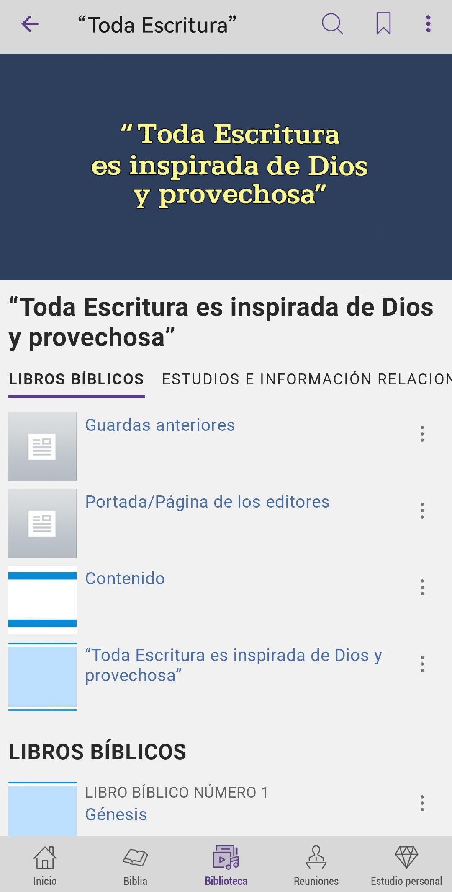

# JWPUB

Download custom jwpub files in different languages for JW Library // Descarga archivos jwpub personalizados en diferentes idiomas para JW Library

Available languages // Idiomas disponibles:
1. Spanish // Español
2. English // Inglés
3. Yoremnokki
4. Hiligaynon
5. Brazilian Portuguese // Portugués Brasileño
6. German // Alemán

Installation // Instalación:
1. Open the file using JW Library // Abra el archivo con JW Library
2. Go to Library tab // Vaya a “Biblioteca”
3. Then go to the appropriate category // Luego a la categoría que le corresponda

____
____
## JWPUB
* [2024 Convention Notebook](#2024-convention-notebook-)
* [¡Al’leake jiba bechïbo jiapsa! Ju Biblia enchi a bit’tuana jáchini](#alleake-jiba-bechïbo-jiapsa-ju-biblia-enchi-a-bittuana-jáchini-)
* [¡Al’leake jiba bechïbo jiapsa! Jume bat lecciónim Bíbliata bétana](#alleake-jiba-bechïbo-jiapsa-jume-bat-lecciónim-bíbliata-bétana-)
* [Cuadérno jü Conmemoraciónta 2024ta bechïbo](#cuadérno-jü-conmemoraciónta-2024ta-bechïbo-)
* [Cuaderno naw yayajäpota 2024po bechïbo](#cuaderno-naw-yayajäpota-2024po-bechïbo-)
* [Historias biblicas ilustradas](#historias-biblicas-ilustradas-)
* [Programa de lectura de la Biblia](#programa-de-lectura-de-la-biblia-)
* [La Torre del Vigía y Heraldo de la Presencia de Cristo, 1 de marzo de 1925](#la-torre-del-vigía-y-heraldo-de-la-presencia-de-cristo-1-de-marzo-de-1925-)
* [Comentario sobre la carta de Santigo](#comentario-sobre-la-carta-de-santigo-)
* [Caderno do Congresso de 2024](#caderno-do-congresso-de-2024-)
* [Notebook sang 2024 nga Kombension](#notebook-sang-2024-nga-kombension-)
* [Notizbuch für den Kongress 2024](#notizbuch-für-den-kongress-2024-)
* [“Toda Escritura”](#toda-escritura-)
* [Sírvase visitar](#sírvase-visitar-)
* [Please Follow Up](#please-follow-up-)
* [Arem aman weyye](#arem-aman-weyye-)
* [Cuaderno naw yayajäpota circuítota 2024-2025po béchïbo (Superintendente circuítopo anémemaki)](#cuaderno-naw-yayajäpota-circuítota-2024-2025po-béchïbo-superintendente-circuítopo-anémemaki-)
* [Cuaderno naw yayajäpota circuítota 2024-2025po béchïbo (Representantetámaki Sucursalta bétana)](#cuaderno-naw-yayajäpota-circuítota-2024-2025po-béchïbo-representantetámaki-sucursalta-bétana-)
* [2024-2025 Circuit Assembly Notebook With Circuit Overseer](#2024-2025-circuit-assembly-notebook-with-circuit-overseer-)
* [2024-2025 Circuit Assembly Notebook With Branch Representative](#2024-2025-circuit-assembly-notebook-with-branch-representative-)

____
## 2024 Convention Notebook [⇧](#jwpub)

* **Language**: English
* **Type of publication**: Program
* **Last release**: [*CO-cdrn24_E.jwpub*](https://github.com/MisaelArciniega/JWPUB/releases/download/CO-cdrn24_E.jwpub/CO-cdrn24_E.jwpub)
* **Released**: [02-05-2024]

____
## ¡Al’leake jiba bechïbo jiapsa! Ju Biblia enchi a bit’tuana jáchini [⇧](#jwpub)

* **Idioma**: Yoremnokki
* **Tipo de publicación**: Libro
* **Última actualización**: [*lffc_MYO.jwpub*](https://github.com/MisaelArciniega/JWPUB/releases/download/lffc_MYO.jwpub/lffc_MYO.jwpub)
* **Publicado**: [11-03-2024]

____
## ¡Al’leake jiba bechïbo jiapsa! Jume bat lecciónim Bíbliata bétana [⇧](#jwpub)

* **Idioma**: Yoremnokki
* **Tipo de publicación**: Folleto
* **Última actualización**: [*lffic_MYO.jwpub*](https://github.com/MisaelArciniega/JWPUB/releases/download/lffic.jwpub/lffic.jwpub)
* **Publicado**: [26-02-2024]

____
## Cuadérno jü Conmemoraciónta 2024ta bechïbo [⇧](#jwpub)

* **Idioma**: Yoremnokki
* **Tipo de publicación**: Folleto
* **Última actualización**: [*cdrn-mi24_MYO.jwpub*](https://github.com/MisaelArciniega/JWPUB/releases/download/cdrn-mi24_MYO.jwpub/cdrn-mi24_MYO.jwpub)
* **Publicado**: [26-02-2024]

____
## Cuaderno naw yayajäpota 2024po bechïbo [⇧](#jwpub)

* **Idioma**: Yoremnokki
* **Tipo de publicación**: Programa
* **Última actualización**: [*CO-cdrn24_MYO.jwpub*](https://github.com/MisaelArciniega/JWPUB/releases/download/CO-cdrn24_MYO.jwpub/CO-cdrn24_MYO.jwpub)
* **Publicado**: [09-06-2024]

____
## Historias biblicas ilustradas [⇧](#jwpub)

* **Idioma**: Español
* **Tipo de publicación**: Catálogo de artículos
* **Última actualización**: [*ibs_S.jwpub*](https://github.com/MisaelArciniega/JWPUB/releases/download/ibs_S.jwpub/ibs_S.jwpub)
* **Publicado**: [12-06-2023]

____
## Programa de lectura de la Biblia [⇧](#jwpub)

* **Idioma**: Español
* **Tipo de publicación**: Programa
* **Última actualización**: [*brp_S.jwpub*](https://github.com/MisaelArciniega/JWPUB/releases/download/brp_S.jwpub/brp_S.jwpub)
* **Publicado**: [12-07-2023]

____
## La Torre del Vigía y Heraldo de la Presencia de Cristo, 1 de marzo de 1925 [⇧](#jwpub)

* **Idioma**: Español
* **Tipo de publicación**: La Atalaya
* **Última actualización**: [*w_S_19250301.jwpub*](https://github.com/MisaelArciniega/JWPUB/releases/download/w_S_19250301.jwpub/w_S_19250301.jwpub)
* **Publicado**: [25-04-2023]

____
## Comentario sobre la carta de Santigo [⇧](#jwpub)

* **Idioma**: Español
* **Tipo de publicación**: Libro
* **Última actualización**: [*cj_S.jwpub*](https://github.com/MisaelArciniega/JWPUB/releases/download/cj_S.jwpub/cj_S.jwpub)

* **Publicado**: [20-05-2024]

____
## Caderno do Congresso de 2024 [⇧](#jwpub)

* **Language**: Brazilian Portuguese
* **Type of publication**: Program
* **Last release**: [*CO-cdrn24_T.jwpub*](https://github.com/MisaelArciniega/JWPUB/releases/download/CO-cdrn24_T.jwpub/CO-cdrn24_T.jwpub)
* **Released**: [15-06-2024]

____
## Notebook sang 2024 nga Kombension [⇧](#jwpub)

* **Language**: Hiligaynon
* **Type of publication**: Program
* **Last release**: [*CO-cdrn24_HV.jwpub*](https://github.com/MisaelArciniega/JWPUB/releases/download/CO-cdrn24_HV.jwpub/CO-cdrn24_HV.jwpub)
* **Released**: [15-06-2024]

____
## Notizbuch für den Kongress 2024 [⇧](#jwpub)

* **Language**: German
* **Type of publication**: Program
* **Last release**: [*CO-cdrn24_X.jwpub*](https://github.com/MisaelArciniega/JWPUB/releases/download/CO-cdrn24_X.jwpub/CO-cdrn24_X.jwpub)
* **Released**: [20-06-2024]

____
## “Toda Escritura” [⇧](#jwpub)

* **Idioma**: Español
* **Tipo de publicación**: Libro
* **Última actualización**: [*si_S.jwpub*](https://github.com/MisaelArciniega/JWPUB/releases/download/si_S.jwpub/si_S.jwpub)
* **Publicado**: [23-06-2024]

____
## Sírvase visitar [⇧](#jwpub)

* **Idioma**: Español
* **Tipo de publicación**: Formulario
* **Última actualización**: [*S-43_S.jwpub*](https://github.com/MisaelArciniega/JWPUB/releases/download/S-43_S.jwpub/S-43_S.jwpub)
* **Publicado**: [05-07-2024]

____
## Please Follow Up [⇧](#jwpub)

* **Language**: English
* **Type of publication**: Form
* **Last release**: [*S-43_E.jwpub*](https://github.com/MisaelArciniega/JWPUB/releases/download/S-43_E.jwpub/S-43_E.jwpub)
* **Released**: [08-07-2024]

____
## Arem aman weyye [⇧](#jwpub)

* **Idioma**: Yoremnokki
* **Tipo de publicación**: Formulario
* **Última actualización**: [*S-43_MYO.jwpub*](https://github.com/MisaelArciniega/JWPUB/releases/download/S-43_MYO.jwpub/S-43_MYO.jwpub)
* **Publicado**: [03-08-2024]

____
## Cuaderno naw yayajäpota circuítota 2024-2025po béchïbo (Superintendente circuítopo anémemaki) [⇧](#jwpub)

* **Idioma**: Yoremnokki
* **Tipo de publicación**: Programa
* **Última actualización**: [*CA-cocdrn25_MYO.jwpub*](https://github.com/MisaelArciniega/JWPUB/releases/download/CA-cocdrn25_MYO.jwpub/CA-cocdrn25_MYO.jwpub)
* **Publicado**: [03-08-2024]

____
## Cuaderno naw yayajäpota circuítota 2024-2025po béchïbo (Representantetámaki Sucursalta bétana) [⇧](#jwpub)

* **Idioma**: Yoremnokki
* **Tipo de publicación**: Programa
* **Última actualización**: [*CA-brcdrn25_MYO.jwpub*](https://github.com/MisaelArciniega/JWPUB/releases/download/CA-brcdrn25_MYO.jwpub/CA-brcdrn25_MYO.jwpub)
* **Publicado**: [03-08-2024]

____
## 2024-2025 Circuit Assembly Notebook With Circuit Overseer [⇧](#jwpub)

* **Language**: English
* **Type of publication**: Program
* **Last release**: [*CA-cocdrn25_E.jwpub*](https://github.com/MisaelArciniega/JWPUB/releases/download/CA-cocdrn25_E.jwpub/CA-cocdrn25_E.jwpub)
* **Released**: [05-08-2024]

____
## 2024-2025 Circuit Assembly Notebook With Branch Representative [⇧](#jwpub)

* **Language**: English
* **Type of publication**: Program
* **Last release**: [*CA-brcdrn25_E.jwpub*](https://github.com/MisaelArciniega/JWPUB/releases/download/CA-brcdrn25_E.jwpub/CA-brcdrn25_E.jwpub)
* **Released**: [05-08-2024]
____
____
