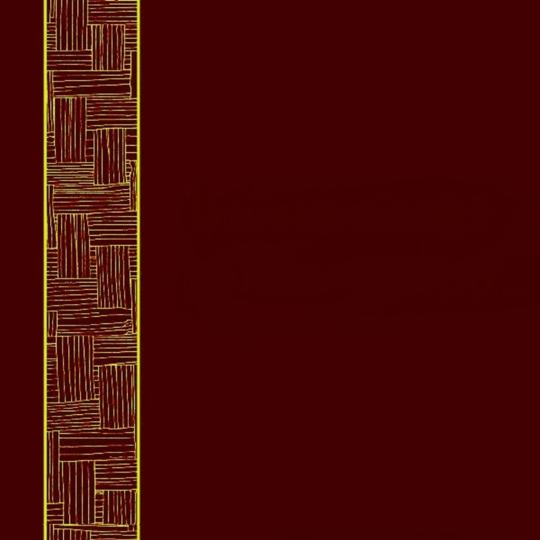
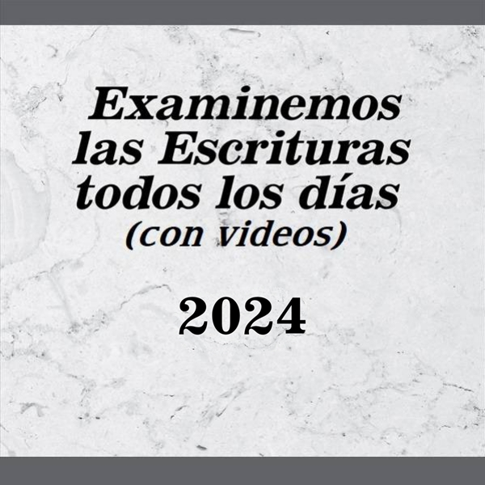
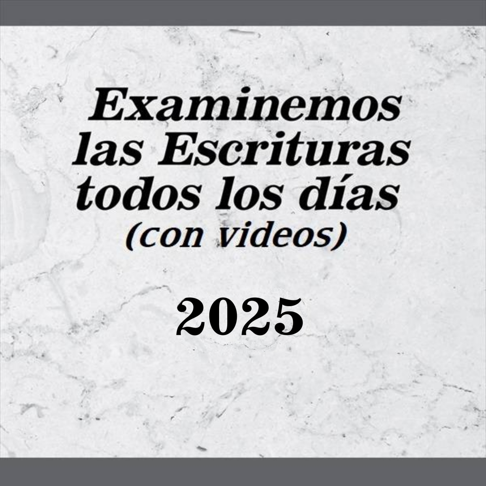

# JWPUB

Archivos <code>.jwpub</code> diseñados para el estudio personal en JW Library

**Instalación**
1. Abre el archivo con JW Library
2. Ve a <code>Biblioteca</code>
3. Ve a la categoría de publicación señalada

____
____
## Biblia Hispanoamericana (Traducción Interconfesional, 2011)

* **Tipo de publicación**: Biblia
* **Idioma**: [*Español*](https://github.com/MisaelArciniega/JWPUB/releases/download/bhti_S.jwpub/bhti_S.jwpub)

____
## Dios habla hoy (1994)

* **Tipo de publicación**: Biblia
* **Idioma**: [*Español - v2*](https://github.com/MisaelArciniega/JWPUB/releases/download/dhh_S.jwpub/dhh_S.jwpub)
* **Actualización:** 18-03-2025
* **Cambios en la v2:**
  1. Correcciones en el Salmo 119

____
## La Biblia de las Américas (1997)

* **Tipo de publicación**: Biblia
* **Idioma**: [*Español - v2*](https://github.com/MisaelArciniega/JWPUB/releases/download/lbla_S.jwpub/lbla_S.jwpub)
* **Actualización:** 17-03-2025
* **Cambios en la v2:**
  1. Eliminación de asteriscos en el texto (posibles notas marginales)

____
## Versión Moderna (1929)

* **Tipo de publicación**: Biblia
* **Idioma**: [*Español - v3*](https://github.com/MisaelArciniega/JWPUB/releases/download/vm_S.jwpub/vm_S.jwpub)
* **Actualización:** 18-03-2025
* **Cambios en la v3:**
  1. Correcciones en el Salmo 119

____
## Versión Biblia Libre

* **Tipo de publicación**: Biblia
* **Idioma**: [*Español - v2*](https://github.com/MisaelArciniega/JWPUB/releases/download/fbv_S.jwpub/fbv_S.jwpub)
* **Cambios en la v2:**
  1. Correción en titulillos omitidos en los capítulos 1, 42, 73, 90 y 107 de los Salmos
  2. Agregación de estilo Bold en titulillos del Salmo 119
  3. Correcciones ortográficas en 1 Jn 5:7, 10: [7. “Asó” por “Así”] [10. “Dios mentirosos” por “Dios mentiroso”]. Vea el original <a href="https://ebible.org/spavbl/1JN05.htm">aquí</a>.

____
## Biblia Interlineal

* **Tipo de publicación**: Biblia
* **Idioma**: [*Español - v2*](https://github.com/MisaelArciniega/JWPUB/releases/download/int_S.jwpub/int_S.jwpub)
* **Cambios en la v2:**
  1. Correción en titulillos omitidos en los capítulos 1, 42, 73, 90 y 107 de los Salmos
  2. Agregación de estilo Bold en titulillos del Salmo 119

____
## Reina Valera 1960

* **Tipo de publicación**: Biblia
* **Idioma**: [*Español - v2*](https://github.com/MisaelArciniega/JWPUB/releases/download/rv1960_S.jwpub/rv1960_S.jwpub)
* **Cambios en la v2:**
  1. Correción en titulillos omitidos en los capítulos 1, 42, 73, 90 y 107 de los Salmos
  2. Agregación de estilo Bold en titulillos del Salmo 119

____
## Diosta nooki yorem nokpo (Antiguo Testamento)

* **Tipo de publicación**: Biblia
* **Idioma**: [*Yoremnokki*](https://github.com/MisaelArciniega/JWPUB/releases/download/dnyn-at_MYO.jwpub/dnyn-at_MYO.jwpub)

____
## Diosta nooki yorem nokpo (Nuevo Testamento)

* **Tipo de publicación**: Biblia
* **Idioma**: [*Yoremnokki - v2*](https://github.com/MisaelArciniega/JWPUB/releases/download/dnyn-nt_MYO.jwpub/dnyn-nt_MYO.jwpub)
* **Cambios en la v2:**
  1. Correción en versículos incompletos.
____
## “¿Ha escuchado alguien algo como esto?” (Deut. 4:32)

* **Tipo de publicación**: Catálogo de artículos
* **Idioma**: [*Español*](https://github.com/MisaelArciniega/JWPUB/releases/download/cda_S.jwpub/cda_S.jwpub)

____
## Programa de lectura de la Biblia

* **Tipo de publicación**: Programas
* **Nota**: Adaptado del libro “Disfrute” y del programa en <code>pdf</code> disponible en jw.org
* **Idioma**: [*Español*](https://github.com/MisaelArciniega/JWPUB/releases/download/brp_S.jwpub/brp_S.jwpub)

____
## Cuadérno jü Conmemoraciónta 2024ta bechïbo

* **Tipo de publicación**: Libro
* **Idioma**: [*Yoremnokki*](https://github.com/MisaelArciniega/JWPUB/releases/download/cdrn-mi24_MYO.jwpub/cdrn-mi24_MYO.jwpub)

____
## Comentario sobre la carta de Santiago

* **Tipo de publicación**: Libro
* **Idioma**: [*Español*](https://github.com/MisaelArciniega/JWPUB/releases/download/cj_S.jwpub/cj_S.jwpub)

____
## Cuaderno de apuntes para la asamblea regional 2024

 
* **Tipo de publicación**: Programas
* **Idioma**: [*Yoremnokki*](https://github.com/MisaelArciniega/JWPUB/releases/download/CO-cdrn24_MYO.jwpub/CO-cdrn24_MYO.jwpub)

____
## “Toda Escritura”

* **Tipo de publicación**: Libro
* **Idioma**: [*Español*](https://github.com/MisaelArciniega/JWPUB/releases/download/si_S.jwpub/si_S.jwpub)

____
## Sírvase visitar

* **Tipo de publicación**: Formulario
* **Idioma**: [*Español*](https://github.com/MisaelArciniega/JWPUB/releases/download/S-43_S.jwpub/S-43_S.jwpub), [*Yoremnokki*](https://github.com/MisaelArciniega/JWPUB/releases/download/S-43_MYO.jwpub/S-43_MYO.jwpub)

____
## Cuaderno de apuntes para la asamblea de circuito 2024-2025 (con el superintendente de circuito)

* **Tipo de publicación**: Programas
* **Idioma**: [*Español*](https://github.com/MisaelArciniega/JWPUB/releases/download/CA-cocdrn25_S.jwpub/CA-cocdrn25_S.jwpub), [*Yoremnokki*](https://github.com/MisaelArciniega/JWPUB/releases/download/CA-cocdrn25_MYO.jwpub/CA-cocdrn25_MYO.jwpub)

____
## Cuaderno de apuntes para la asamblea de circuito 2024-2025 (con el representante de la Sucursal)

* **Tipo de publicación**: Programas
* **Idioma**: [*Español*](https://github.com/MisaelArciniega/JWPUB/releases/download/CA-brcdrn25_S.jwpub/CA-brcdrn25_S.jwpub), [*Yoremnokki*](https://github.com/MisaelArciniega/JWPUB/releases/download/CA-brcdrn25_MYO.jwpub/CA-brcdrn25_MYO.jwpub)

____
## Examinemos las Escrituras todos los días 2024 (con videos)

* **Tipo de publicación**: Folletos
* **Idioma**: [*Español*](https://github.com/MisaelArciniega/JWPUB/releases/download/es24_S.jwpub/es24_S.jwpub)

____
## Examinemos las Escrituras todos los días 2025 (con videos)

* **Tipo de publicación**: Folletos
* **Idioma**: [*Español*](https://github.com/MisaelArciniega/JWPUB/releases/download/es25_S.jwpub/es25_S.jwpub)

____
## Programas de lectura de la Biblia

* **Tipo de publicación**: Folletos
* **Idioma**: [*Español*](https://github.com/MisaelArciniega/JWPUB/releases/download/sbr_S.jwpub/sbr_S.jwpub)

____
____
