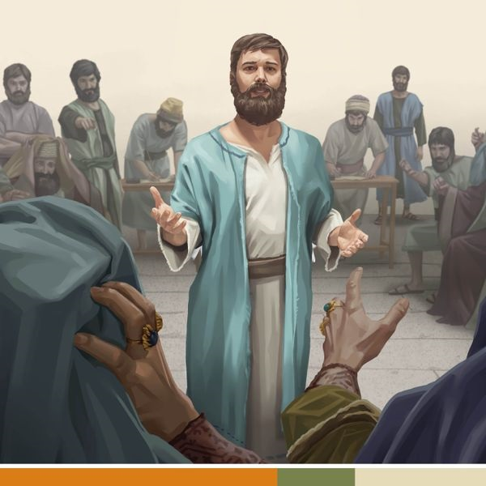

# JWPUB

Archivos <code>.jwpub</code> para JW Library

**Instalación**
1. Abre el archivo con JW Library
2. Ve a <code>Biblioteca</code>
3. Ve a la categoría de publicación señalada

____
____
## Versión Moderna (1929)

* **Tipo de publicación**: Biblia
* **Idioma**: [*Español - v1*](https://github.com/MisaelArciniega/JWPUB/releases/download/vm_S.jwpub/vm_S.jwpub)

____
## Versión Biblia Libre

* **Tipo de publicación**: Biblia
* **Idioma**: [*Español- v2*](https://github.com/MisaelArciniega/JWPUB/releases/download/fbv_S.jwpub/fbv_S.jwpub)

____
## Biblia Interlineal

* **Tipo de publicación**: Biblia
* **Idioma**: [*Español - v2*](https://github.com/MisaelArciniega/JWPUB/releases/download/int_S.jwpub/int_S.jwpub)

____
## Reina Valera 1960

* **Tipo de publicación**: Biblia
* **Idioma**: [*Español - v2*](https://github.com/MisaelArciniega/JWPUB/releases/download/rv1960_S.jwpub/rv1960_S.jwpub)

____
## Diosta nooki yorem nokpo (Antiguo Testamento)

* **Tipo de publicación**: Biblia
* **Idioma**: [*Yoremnokki*](https://github.com/MisaelArciniega/JWPUB/releases/download/dnyn-at_MYO.jwpub/dnyn-at_MYO.jwpub)

____
## Diosta nooki yorem nokpo (Nuevo Testamento)

* **Tipo de publicación**: Biblia
* **Idioma**: [*Yoremnokki*](https://github.com/MisaelArciniega/JWPUB/releases/download/dnyn-nt_MYO.jwpub/dnyn-nt_MYO.jwpub)

____
## La Torre del Vigía 1925

* **Tipo de publicación**: Libro
* **Idioma**: [*Español*](https://github.com/MisaelArciniega/JWPUB/releases/download/w_S_19250301.jwpub/w_S_19250301.jwpub)

____
## Historias bíblicas ilustradas

* **Tipo de publicación**: Catálogo de artículos
* **Idioma**: [*Español*](https://github.com/MisaelArciniega/JWPUB/releases/download/ibs_S.jwpub/ibs_S.jwpub)

____
## Programa de lectura de la Biblia

* **Tipo de publicación**: Programas
* **Nota**: Adaptado del libro “Disfrute” y del programa en <code>pdf</code> disponible en jw.org
* **Idioma**: [*Español*](https://github.com/MisaelArciniega/JWPUB/releases/download/brp_S.jwpub/brp_S.jwpub)

____
## ¡Al’leake jiba bechïbo jiapsa! Jume bat lecciónim Bíbliata bétana

* **Tipo de publicación**: Folletos
* **Idioma**: [*Yoremnokki*](https://github.com/MisaelArciniega/JWPUB/releases/download/lffic.jwpub/lffic.jwpub)

____
## Cuadérno jü Conmemoraciónta 2024ta bechïbo

* **Tipo de publicación**: Libro
* **Idioma**: [*Yoremnokki*](https://github.com/MisaelArciniega/JWPUB/releases/download/cdrn-mi24_MYO.jwpub/cdrn-mi24_MYO.jwpub)

____
## ¡Al’leake jiba bechïbo jiapsa! Ju Biblia enchi a bit’tuana jáchini

* **Tipo de publicación**: Libro
* **Idioma**: [*Yoremnokki*](https://github.com/MisaelArciniega/JWPUB/releases/download/lffc_MYO.jwpub/lffc_MYO.jwpub)

____
## Comentario sobre la carta de Santiago

* **Tipo de publicación**: Libro
* **Idioma**: [*Español*](https://github.com/MisaelArciniega/JWPUB/releases/download/cj_S.jwpub/cj_S.jwpub)

____
## Cuaderno de apuntes para la asamblea regional 2024

 
* **Tipo de publicación**: Programas
* **Idioma**: [*Yoremnokki*](https://github.com/MisaelArciniega/JWPUB/releases/download/CO-cdrn24_MYO.jwpub/CO-cdrn24_MYO.jwpub)

____
## “Toda Escritura”

* **Tipo de publicación**: Libro
* **Idioma**: [*Español*](https://github.com/MisaelArciniega/JWPUB/releases/download/si_S.jwpub/si_S.jwpub)

____
## Sírvase visitar

* **Tipo de publicación**: Formulario
* **Idioma**: [*Español*](https://github.com/MisaelArciniega/JWPUB/releases/download/S-43_S.jwpub/S-43_S.jwpub), [*Yoremnokki*](https://github.com/MisaelArciniega/JWPUB/releases/download/S-43_MYO.jwpub/S-43_MYO.jwpub)

____
## Cuaderno de apuntes para la asamblea de circuito 2024-2025 (con el superintendente de circuito)

* **Tipo de publicación**: Programas
* **Idioma**: [*Español*](https://github.com/MisaelArciniega/JWPUB/releases/download/CA-cocdrn25_S.jwpub/CA-cocdrn25_S.jwpub), [*Yoremnokki*](https://github.com/MisaelArciniega/JWPUB/releases/download/CA-cocdrn25_MYO.jwpub/CA-cocdrn25_MYO.jwpub)

____
## Cuaderno de apuntes para la asamblea de circuito 2024-2025 (con el representante de la Sucursal)

* **Tipo de publicación**: Programas
* **Idioma**: [*Español*](https://github.com/MisaelArciniega/JWPUB/releases/download/CA-brcdrn25_S.jwpub/CA-brcdrn25_S.jwpub), [*Yoremnokki*](https://github.com/MisaelArciniega/JWPUB/releases/download/CA-brcdrn25_MYO.jwpub/CA-brcdrn25_MYO.jwpub)

____
## Examinemos las Escrituras todos los días 2024 (con videos)

* **Tipo de publicación**: Folletos
* **Idioma**: [*Español*](https://github.com/MisaelArciniega/JWPUB/releases/download/es24_S.jwpub/es24_S.jwpub)

____
## Examinemos las Escrituras todos los días 2025 (con videos)

* **Tipo de publicación**: Folletos
* **Idioma**: [*Español*](https://github.com/MisaelArciniega/JWPUB/releases/download/es25_S.jwpub/es25_S.jwpub)

____
## Programas de lectura de la Biblia

* **Tipo de publicación**: Folletos
* **Idioma**: [*Español*](https://github.com/MisaelArciniega/JWPUB/releases/download/sbr_S.jwpub/sbr_S.jwpub)

____
____
